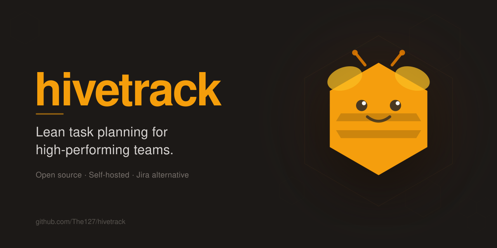

<div align="center">
  
  <h1>Hivetrack</h1>
  <p>Lean, self-hosted task planning for high-performing software teams.</p>
  <p>
    A Jira alternative that helps the people doing the work — not the people watching it.<br>
    Fast, opinionated, open source.
  </p>
  
</div>

---

## Quick start

```bash
just dev-deps   # start postgres
just dev        # start backend + frontend
```

Backend runs at `http://localhost:8080`, frontend at `http://localhost:5173`.

You'll need an OIDC provider for auth. [Keyline](https://github.com/the127/keyline) is the recommended companion — see [docs/architecture.md](docs/architecture.md) for setup.

## Repository layout

```
hivetrack/       Go backend (HTTP API)
hivetrack-ui/    Vue 3 frontend
docs/            Architecture and design documentation
justfile         Task runner — run `just` to see all recipes
```

## Development

```bash
just dev              # start everything locally
just test             # run all tests (no DB needed)
just check            # lint + tests — run before pushing
just install-hooks    # install git pre-push hook
```

## Documentation

| Doc | Contents |
|---|---|
| [docs/architecture.md](docs/architecture.md) | System architecture, auth, deployment |
| [docs/domain-model.md](docs/domain-model.md) | Full entity definitions and relationships |
| [docs/engineering-principles.md](docs/engineering-principles.md) | TDD, patterns, coding conventions |
| [docs/api-and-ai.md](docs/api-and-ai.md) | API design, webhooks, AI integration |

## Stack

**Backend:** Go 1.24 · PostgreSQL · CQRS + mediator · IoC DI
**Frontend:** Vue 3 · Vite · TanStack Query · Tailwind CSS v4
**Auth:** OIDC — Keyline, Keycloak, Authentik, or any compliant provider
